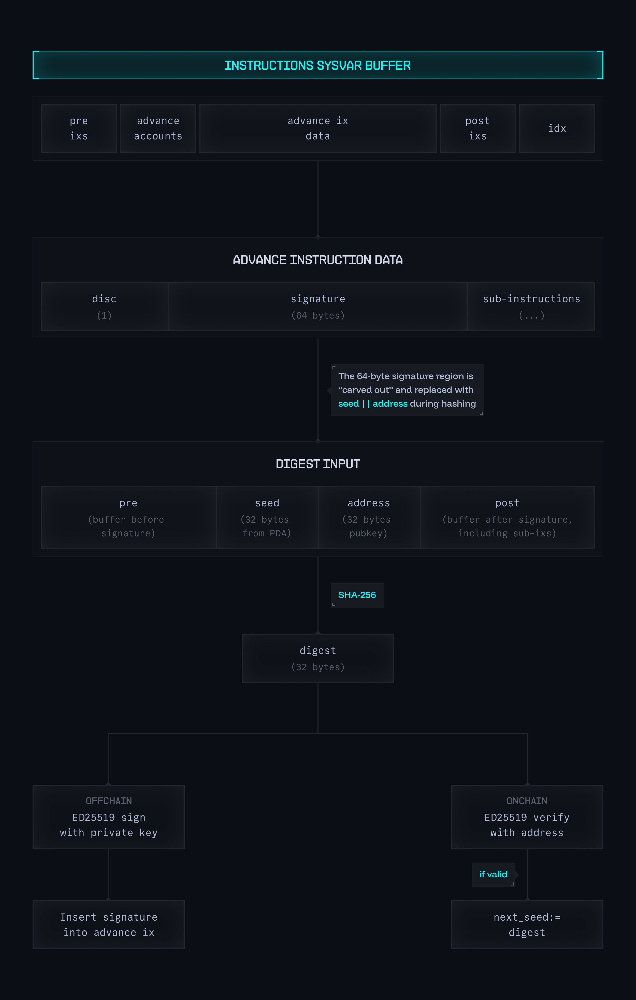

# Vector
Vector is a Solana primitive for offchain transaction signing that can be used in place of durable nonce workflows.

It works by computing a SHA-256 digest of a transaction offchain and signing that digest with Ed25519. Vector then reproduces the same digest onchain from the instructions sysvar at execution time and verifies the signature before allowing execution to proceed.

To avoid signature recursion in the buffer, the 64-byte signature in the instruction data is not hashed directly. Instead, it is substituted with the current Vector seed and account public key. This makes the signed digest deterministic, binds it to a specific Vector state, and ensures that each signature is single-use.

## Execution Model
A Vector authorization flow proceeds as follows:

1. A transaction is constructed offchain.
2. The signature field is replaced with the current Vector seed and public key.
3. The resulting instruction buffer is SHA-256 hashed and the digest is Ed25519-signed offchain.
4. The transaction is submitted onchain.
5. Vector reads the instruction sysvar, performs the same substitution, recomputes the SHA-256 digest, and verifies the signature against it.

If verification succeeds, Vector installs that same digest as its next seed, creating a history-based hashchain, and then proceeds to perform passthrough CPI with its remaining accounts.

Pre-hashing with SHA-256 keeps the input handed to the on-chain Ed25519 verify constant-sized regardless of how large the hosting transaction is, which dramatically reduces the SHA-512 work performed inside the verifier.

The fee payer or relayer is therefore not entrusted with authority over transaction contents at any time, as they are unable to alter the authorized transaction buffer without invalidating its corresponding signature.

## Sighash Algorithm

The following diagram illustrates how Vector computes the digest that binds a signature to a specific transaction and Vector state:

<p align="center">
    
    <br>
</p>

**Key insight:** The digest covers the entire instructions sysvar — all pre-instructions, the advance instruction (minus its signature), and all post-instructions. This commits the signature to the complete transaction context, not just the Vector payload.

**Why substitute instead of hash the signature?** If the signature were included in its own digest, you would need to know the signature before computing the hash, but you need the hash before computing the signature — an impossible recursion. By substituting with `seed || address`, the digest becomes computable before signing while still binding the signature to the specific Vector state.

## Passthrough CPI
Vector acts as a narrow CPI gate in front of ordinary Solana execution. Its role is limited to verifying that the current transaction exactly matches the transaction that was signed offchain against the current Vector state. Once that check succeeds, execution proceeds to a Passthrough CPI, taking the accounts trailing the Advance instruction, along with the embedded instruction data, and performing CPI actions for the owner.

After Passthrough CPI, the downstream instruction flow proceeds as normal. As Vector does not alter downstream semantics, it composes naturally with all existing Solana instruction patterns, including those that depend on temporary authority transfer or intra-transaction liquidity, such as flash loans.

Although `advance` only replays its embedded sub-instructions, the digest it verifies covers every top-level instruction in the hosting transaction, not just `advance` itself. Pre- and post-instructions placed alongside `advance` are committed to by the same signature even though `advance` never executes them itself. This is what lets a relayer-supplied compute-budget instruction, balance check, or memo coexist with a Vector-authorized payload without weakening the signer's authority.

## Security Model
The signer is authorizing a concrete transaction buffer, not a reusable nonce and not a partially specified intent. Since the signed digest is reconstructed from the instruction sysvar onchain, any material change to the transaction changes the digest and invalidates the signature.

This sharply limits relayer authority. A relayer cannot swap programs, rewrite accounts, alter amounts, or append alternative logic while preserving validity. Its role is limited to transport and fee payment.

## Privacy
Vector never materializes the authorized transaction buffer onchain ahead of execution. Signing is a purely computation over the `(seed, address, transaction)` tuple. This means the contents of the transaction itself remain private until the moment a relayer pays to submit it.

This sets Vector apart from other onchain signing primitives which typically require onchain transaction buffer accounts — a smart scaling solution, but also an undesirable property for transactions revealing actionable economic data onchain long before it is executed.

## Seed Progression
Vector advances state by reusing the same SHA-256 digest that was just verified as the next seed:

```
next_seed = SHA256(pre || current_seed || address || post)
```

where `pre` and `post` together cover the entire instructions sysvar buffer minus the 64-byte signature region. Because `current_seed` is itself an input to the hash, every seed transition is a deterministic function of both the prior state and the exact transaction being authorized — there is no separate mixing pass and no second hash.

The signature itself is not used as the state transition input, as the ephemeral scalar used in nonce generation is malleable. Tying the progression to the digest of the current seed and the current authorized buffer ensures that state advancement is determined by the actual transaction being authorized.

## Invalidation and Forward Exposure
In a monotonically increasing counter-based nonce scheme, all future states are exposed at all times. This can cause security assumptions to break down in interesting, rarely thought about ways. Consider the following scenario:

1. At state N, remove 90% of liquidity from our vault.
2. At state N+1, place all remaining liquidity into escrow.
3. At state N+2, swap the escrowed amount for another token.

If these 3 transactions were securely presigned, but the transaction at state N were to later be replaced with an empty Vector advance instruction, the executed price of the swap in N+2 would be 90% worse.

Vector avoids this breakdown of security assumptions entirely by deriving each Vector state from the current state and the current executed transaction buffer hash. This means each later state depends on the exact prior chain of executions having occurred in order. A state analogous to N+2 cannot become valid unless N+1 has already occurred. Future states are therefore not independently valid, and belong to a deterministic hashchain of all potential midstates.

In addition to reducing exposure to such attacks from N+i to N+1, if at any point the immediate next state, or any chain of future states derived from it are believed to be compromised, it is sufficient to simply advance the Vector state with a single, inert transition. This invalidates every hypothetical future signature derived from the previous seed, permanently orphaning the entire branch of potential future states.

## Transaction Expiration
Vector only invalidates a signature once the Vector seed advances. This means signatures revealed in transactions that failed due to transient conditions such as slippage could later become valid and be replayed. Furthermore, a malicious relayer could withold the transaction, waiting until conditions move in their favor, such as a stale quote, a shift in the market market or a liquidation threshold, before submitting.

The mitigation is a small timeout instruction placed as a top-level instruction alongside `advance`. Because the signature commits to the entire instructions sysvar, the timeout is part of the authorized buffer. A minimal program such as [sbpf-asm-timeout](https://github.com/deanmlittle/sbpf-asm-timeout) reads a deadline from its instruction data, reads the current slot or unix timestamp from the clock sysvar, and aborts if the deadline has passed. Any submission attempt after the deadline fails, invalidating the signature.

Vector deliberately remains unopinionated about expiration so users can compose with whatever deadline primitive suits their needs (slot-based, unix-time-based, oracle-based) without bloating the core protocol.

## Relayers and EOAs
Vector constrains a relayer from modifying a user’s transaction. It makes no attempt to eliminate the relayer’s own trust and custody risks towards the user. Relayers may fail operationally even though Vector’s transaction authorization remains intact.

This means that, while Vector is compatible with all EOAs, including those of relayers, it is up to relayers to protect themselves from all forms of operational risks, such as loss of funds, reassignment, or otherwise somehow becoming bricked.

One simple way to mitigate this is to require Vector users to place an ownership and balance check instruction at the end of their transaction. By knowing the balance of a relayer's EOA at the start of a transaction, it is sufficient to simply check that its balance has since increased or remains the same, and that it still belongs to the SystemProgram. This protects relayers by virtue of their right of refusal to sign.

## Initialization
A Vector account is created via the `initialize` instruction, which allocates a 65-byte PDA at `["vector", address]` under the Vector program. The PDA stores `(seed, address, bump)`, where `address` is the Ed25519 public key authorized to sign advances. Each address has at most one Vector account, since the PDA derivation is canonical.

The initial seed is derived entirely onchain using the `sol_get_sysvar` syscall to read the most recent slot hash and height from the `SlotHashes` sysvar, enabling us to calculate the 32-byte seed: `sha256(address || latest_slot_height || latest_slot_hash)`. This time-based pRNG mechanism ensures that if an account is closed and the same address is later re-initialized, the seed will differ, as the slot hash changes in every slot. The conditions required to replay a prior signature chain would require the account to be: opened → used → closed → reopened → replayed – all within the same slot; a set of circumstances that is technically infeasible without cooperation of both the private key holder and a colluding validator.

## Closing a Vector Account
A Vector account is closed via a dedicated `close` instruction that reuses the same signature scheme as `advance`. The signer authorizes a `(seed, address, close_to)` tuple under the current Vector state, the program reconstructs the same SHA-256 digest from the instructions sysvar, verifies the Ed25519 signature, and then drains the PDA's lamports into `close_to` by direct lamport mutation. Once emptied, the runtime reclaims the PDA at the instruction boundary.

Because the signed digest commits to the entire transaction, the recipient and surrounding instructions are bound to the signature: a relayer cannot redirect the lamports or splice in extra top-level instructions without invalidating it. A dedicated instruction is required because Solana's `system_program::transfer` rejects sources that carry data, so a Vector PDA cannot be drained through CPI passthrough alone.

## Client SDK
The `vector-core` crate provides off-chain helpers for constructing Vector transactions:

- `find_vector_pda(address)` — derive the canonical Vector PDA.
- `create_initialize_instruction(payer, address)` — build an `initialize` instruction. The seed is derived on-chain.
- `advance_sighash_digest(seed, address, sub_ixs, pre, post)` — recompute the SHA-256 digest the on-chain program will verify for `advance`.
- `sign_advance_instruction(signing_key, seed, sub_ixs, pre, post)` — sign the digest and return a ready-to-submit `advance` instruction.
- `close_sighash_digest(seed, address, close_to, pre, post)` — recompute the SHA-256 digest the on-chain program will verify for `close`.
- `sign_close_instruction(signing_key, seed, close_to, pre, post)` — sign the digest and return a ready-to-submit `close` instruction.

The signed digest doubles as the next on-chain seed, so a successful advance always replaces `seed` with the digest that authorized it. `close` shares the same signature scheme but skips the seed update because the account is reclaimed in the same instruction.